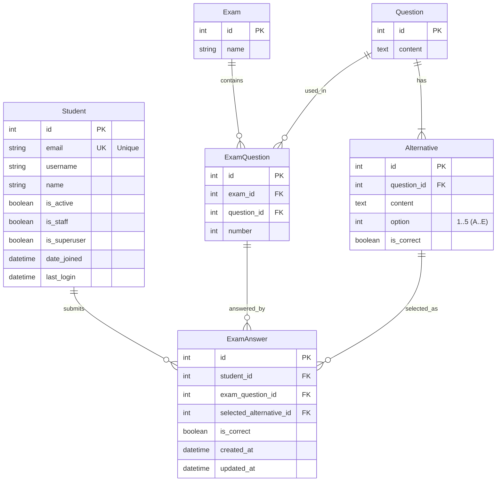
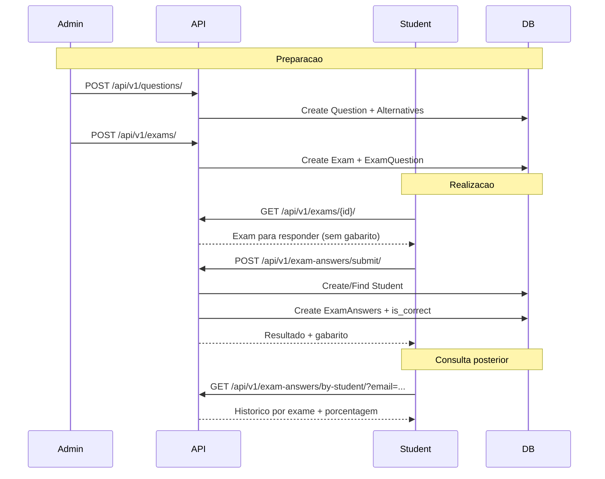

# 📝 Exam Core API

Uma API REST completa para gerenciamento de provas online com questões de múltipla escolha, desenvolvida com **Django REST Framework** e **PostgreSQL**, com **documentação interativa via Swagger**.

**Principais funcionalidades:**
- Sistema de questões com alternativas (A–E)
- Criação e gerenciamento de provas (com ordem das questões)
- Submissão de prova completa em uma única requisição
- Correção automática com gabarito e porcentagem
- Consulta de resultado e histórico de desempenho do estudante
- Swagger UI e ReDoc para uso/teste da API

*******
Tabelas de conteúdo
 1. [Experimente](#experimente)
 2. [Pré-requisitos](#prerequisitos)
 3. [Como rodar a aplicação](#rodando)
 4. [Estrutura do banco de dados](#database)
 5. [Endpoints da API](#endpoints)
 6. [Fluxos principais](#fluxos)
 7. [Regras de negócio](#regras)
 8. [Features](#features)
 9. [Tecnologias](#tecnologias)

*******
<div id='experimente'/>

## 👾 Experimente

- **Swagger UI**: [http://localhost:8000/api/docs/](http://localhost:8000/api/docs/)
- **OpenAPI Schema**: [http://localhost:8000/api/schema/](http://localhost:8000/api/schema/)
- **ReDoc**: [http://localhost:8000/api/redoc/](http://localhost:8000/api/redoc/)
- **Admin Django**: [http://localhost:8000/admin/](http://localhost:8000/admin/)

*******
<div id='prerequisitos'/>

## 🚀 Começando

### 📋 Pré-requisitos

Antes de começar, você precisará ter:
- [Git](https://git-scm.com)
- [Docker](https://www.docker.com/)
- [Docker Compose](https://docs.docker.com/compose/)

**Opcional (desenvolvimento local sem Docker):**
- [Python 3.11+](https://www.python.org/)

Também é recomendado um editor como [VSCode](https://code.visualstudio.com/).

*******
<div id='rodando'/>

## 🎲 Como rodar a aplicação

### 📦 Clonar o repositório

```bash
# Clone o repositório
git clone <URL_DO_REPOSITORIO>
cd exam-core-api
```

### 🐳 Com Docker (recomendado)

O `docker-compose.yml` sobe:
- **API** (`server`) em `:8000`
- **PostgreSQL** (`db`)
- **Testes** (`tests`) (executa `pytest` antes do server ficar healthy)

```bash
# Build + start (API + DB + testes)
docker compose up --build
```

#### Variáveis de ambiente (Docker)

No `docker-compose.yml`, a API usa:
- `DEBUG=True|False`
- `USE_POSTGRES=True` (no compose está como `True`)
- `POSTGRES_HOST`, `POSTGRES_PORT`, `POSTGRES_USER`, `POSTGRES_PASSWORD`, `POSTGRES_DB`

Quando estiver rodando:
- API: [http://localhost:8000](http://localhost:8000)
- Swagger: [http://localhost:8000/api/docs/](http://localhost:8000/api/docs/)

#### Entrar no container e criar superusuário (Admin)

```bash
docker exec -it exam-api bash

# Dentro do container:
python manage.py createsuperuser
```

Depois, acesse o admin: [http://localhost:8000/admin/](http://localhost:8000/admin/)

### 🧪 Rodar testes

```bash
# Rodar o serviço de testes via compose
docker compose up tests --build
```

### 💻 Sem Docker (modo local / SQLite)

Este projeto também suporta rodar localmente com SQLite (útil para dev rápido).

```bash
pip install -r requirements.txt

# Variáveis (opcional)
# DEBUG=True
# USE_POSTGRES=False

# Rodar migrações
python app/manage.py migrate

# Subir servidor
python app/manage.py runserver 0.0.0.0:8000
```

*******
<div id='database'/>

## 🗄️ Estrutura do banco de dados

### Diagrama Entidade-Relacionamento (ERD)



### Constraints importantes (regras no banco)

- **Student**: `email` é único
- **Alternative**: `(question_id, option)` é único
- **ExamQuestion**: `(exam_id, number)` é único
- **ExamAnswer**: `(student_id, exam_question_id)` é único

*******
<div id='endpoints'/>

## 🔌 Endpoints da API

### 📚 Documentação interativa

Use o Swagger UI para testar todos os endpoints: [http://localhost:8000/api/docs/](http://localhost:8000/api/docs/)

### Resumo das rotas (HTTP correto)

#### 👨‍🎓 Estudantes (`/api/v1/students/`)
- `GET /api/v1/students/` - listar
- `POST /api/v1/students/` - criar
- `GET /api/v1/students/{id}/` - detalhar
- `PUT /api/v1/students/{id}/` - atualizar completo
- `PATCH /api/v1/students/{id}/` - atualizar parcial
- `DELETE /api/v1/students/{id}/` - remover

#### ❓ Questões (`/api/v1/questions/`)
- `GET /api/v1/questions/` - listar
- `POST /api/v1/questions/` - criar (com alternativas)
- `GET /api/v1/questions/{id}/` - detalhar
- `PUT /api/v1/questions/{id}/` - atualizar completo
- `PATCH /api/v1/questions/{id}/` - atualizar parcial
- `DELETE /api/v1/questions/{id}/` - remover
- `GET /api/v1/questions/{id}/alternatives/` - listar alternativas
- `POST /api/v1/questions/{id}/alternatives/{alternative_id}/mark-correct/` - marcar alternativa correta

#### 📋 Provas (`/api/v1/exams/`)
- `GET /api/v1/exams/` - listar
- `POST /api/v1/exams/` - criar (pode receber `question_ids`)
- `GET /api/v1/exams/{id}/` - buscar prova para realizar (sem gabarito)
- `PUT /api/v1/exams/{id}/` - atualizar completo
- `PATCH /api/v1/exams/{id}/` - atualizar parcial
- `DELETE /api/v1/exams/{id}/` - remover
- `POST /api/v1/exams/{id}/add-question/` - adicionar questão
- `DELETE /api/v1/exams/{id}/remove-question/{question_id}/` - remover questão
- `POST /api/v1/exams/{id}/reorder-questions/` - reordenar questões

#### ✅ Respostas (`/api/v1/exam-answers/`)
- `GET /api/v1/exam-answers/` - listar (admin/geral)
- `GET /api/v1/exam-answers/{id}/` - detalhar resposta
- `GET /api/v1/exam-answers/by-exam/?exam_id=1` - respostas por prova
- `GET /api/v1/exam-answers/by-student/?email=aluno@email.com` - histórico por estudante (agrupado por prova, com %)
- `GET /api/v1/exam-answers/by-student/?email=aluno@email.com&exam_id=1` - resultado detalhado de uma prova
- `POST /api/v1/exam-answers/submit/` - submeter prova completa (principal)
- `GET /api/v1/exam-answers/result/?exam_id=1&email=aluno@email.com` - consultar resultado

**Nota:** `POST/PUT/PATCH/DELETE` em `/api/v1/exam-answers/` (CRUD direto) estão bloqueados. Use `/submit/`.

*******
<div id='fluxos'/>

## 🔄 Fluxos principais

### Fluxo completo (E2E): criar prova e submeter



### Exemplo rápido (cURL)

#### 1) Criar questão

```bash
curl -X POST "http://localhost:8000/api/v1/questions/" \
  -H "Content-Type: application/json" \
  -d '{
    "content": "Qual é a capital do Brasil?",
    "alternatives": [
      {"content": "São Paulo", "option": 1, "is_correct": false},
      {"content": "Brasília", "option": 2, "is_correct": true},
      {"content": "Rio de Janeiro", "option": 3, "is_correct": false}
    ]
  }'
```

#### 2) Criar prova com questões

```bash
curl -X POST "http://localhost:8000/api/v1/exams/" \
  -H "Content-Type: application/json" \
  -d '{
    "name": "Prova de Geografia",
    "question_ids": [1, 2]
  }'
```

#### 3) Buscar prova para realizar (sem gabarito)

```bash
curl "http://localhost:8000/api/v1/exams/1/"
```

#### 4) Submeter prova completa

As respostas aceitam **letras** (`"A".."E"`) ou **números** (`1..5`).

```bash
curl -X POST "http://localhost:8000/api/v1/exam-answers/submit/" \
  -H "Content-Type: application/json" \
  -d '{
    "email": "aluno@x.com",
    "exam_id": 1,
    "answers": {
      "1": "B",
      "2": "A"
    }
  }'
```

#### 5) Consultar histórico por estudante

```bash
curl "http://localhost:8000/api/v1/exam-answers/by-student/?email=aluno@x.com"
```

*******
<div id='regras'/>

## 📜 Regras de negócio

### Questões e alternativas
- A questão deve ter **1 a 5 alternativas**
- Deve existir **exatamente 1 alternativa correta** por questão
- `option` representa A–E: `1=A`, `2=B`, `3=C`, `4=D`, `5=E`

### Provas
- Uma prova contém questões via `ExamQuestion` (com ordem `number`)
- `GET /api/v1/exams/{id}/` retorna o exame para o estudante **sem expor `is_correct`**

### Submissão e correção
- A prova deve ser enviada **completa** em `POST /api/v1/exam-answers/submit/`
- Cada estudante pode submeter um exame **apenas uma vez**
- Se o email não existir, o estudante é **criado automaticamente**
- O resultado (incluindo gabarito) é retornado imediatamente
- Não é permitido editar/deletar respostas individuais (CRUD bloqueado)

### Consulta de desempenho
- `GET /api/v1/exam-answers/by-student/?email=...` retorna **todos os exames concluídos** pelo estudante, com `%` por exame
- `GET /api/v1/exam-answers/by-student/?email=...&exam_id=...` retorna o exame específico no formato detalhado (equivalente ao `/result/`)

*******
<div id='features'/>

## ✅ Features

- [x] CRUD de estudantes
- [x] CRUD de questões com alternativas
- [x] CRUD de provas + adicionar/remover/reordenar questões
- [x] Prova para responder sem gabarito (`GET /exams/{id}/`)
- [x] Submissão de prova completa (`POST /exam-answers/submit/`)
- [x] Resultado detalhado (`GET /exam-answers/result/`)
- [x] Histórico por estudante (email) com porcentagem por prova (`GET /exam-answers/by-student/`)
- [x] Swagger/OpenAPI (drf-spectacular)
- [x] Testes automatizados (pytest)
- [x] Docker + PostgreSQL

*******
<div id='tecnologias'/>

## 🛠️ Tecnologias

- **Python / Django**
  - `Django==5.0.6`
  - `djangorestframework==3.15`
  - `django-filter==24.2`
  - `drf-spectacular==0.27.0`
- **Banco**
  - PostgreSQL (Docker)
  - SQLite (opcional, local)
- **Testes**
  - `pytest`
  - `pytest-django`
- **Infra**
  - Docker / Docker Compose

*******
